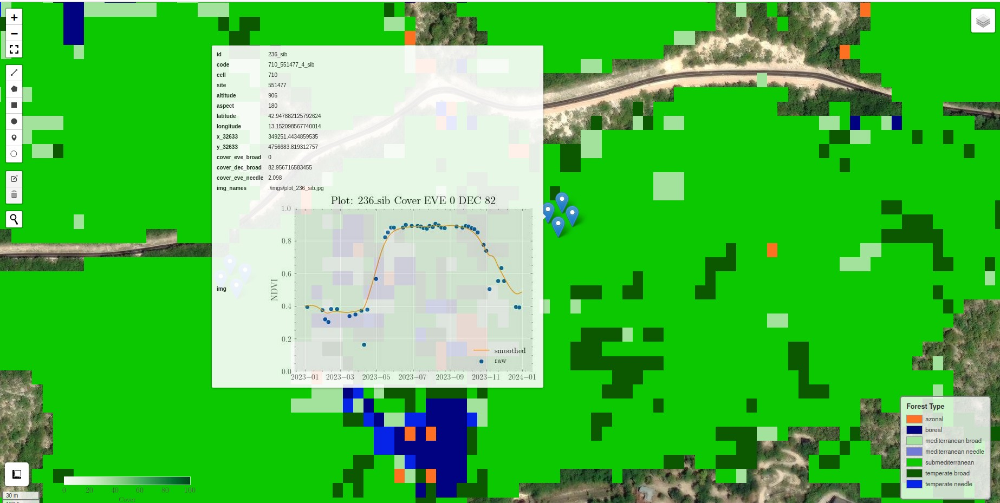
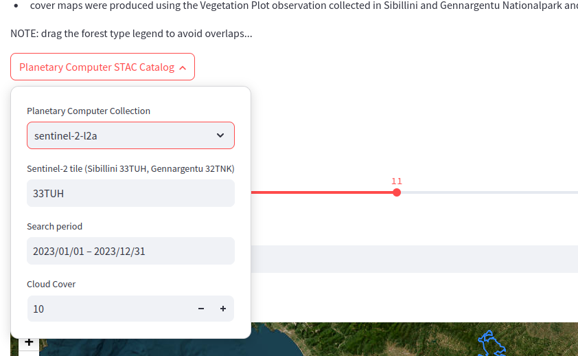
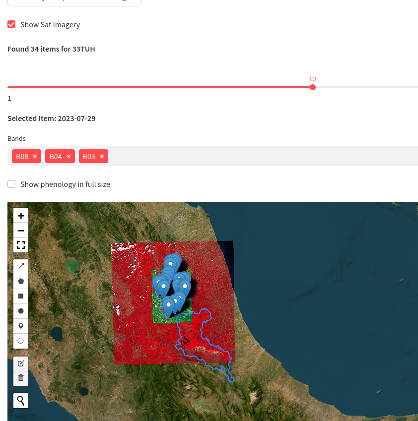

# TRACEVE MAPS

## Introduction

### Use Streamlit

Click on following link and give it a go:
https://mapstraceve.streamlit.app/

- Layers can be made visible using the Layer Manager in the top right corner of the map
  
- by hovering over the plot observation you can inspect the plot statistics including phenology from Sentinel-2 based NDVI
  
- the phenology images can be further enhanced by activating the checkbox above the map and clicking on the newly loaded plots
- Sentinel-2 (and Landsat) imagery from Planetary Computer can be overlayed by using the popup-box
  
- Use the slider to select a date and the textbox to choose the bands
- Choose a combination of 3 bands for false color imagery (e.g. B04,B03,B02 for True Color or B08,B04,B03 for Color Infrared or B12,B04,B03 for False Color)
- Use an expression for calculating indices (e.g. for NDMI: exp:(B08-B11)/(B08+B11))
- Landsat bands are: blue, green, red, nir08, swir16, swir22
- Sentinel-2 bands are: B02, B03, B04, B05, B06, B07,..., SCL
   

**TIPPS:**

- Use the full-screen button on the left side for a better experience (but make sure to memorize the legend/colormap befor...)
- if the map appears white press the Rerun button in the upper right corner of the page

### For fast and easy map-only view
- Download map_sibgen.html (click on file and and hit download button on the right side)
- open .html file in browser

### For even more interactivity use QGIS
- Download maps_traceve.qgz
- open project in QGIS

NOTE: You dont have to download the data as the files are loaded via https directly from the source

### Updates
Updates will be made regularly to this repo by adding new files but also by updating existing layers if necessary

## Data

- Forest Type Map
    - based on Italian Forest Vegetation Database and annual Sentinel-2 time series from 2017 to 2023
    - used model was an InceptionTime ensemble
    - overall accuracy on test split not higher than 76% (this is a preliminary side product from model training for cover estimation)
- Cover Maps (EVE - evergreen broad-leaved; DEC deciduous broad-leaved)
    - based on Vegetation PLot Observation collected in 2023 and aggregated annual Sentinel-2 L2A time series
    - used model is a modified InceptionTime architecture trained with a BetaNLLoss
    - RMSE on the testing split is around 0.14 for both cover types (for a cover range from 0-1)
- Vegetation Plot Observations
    - NDVI phenology is added to each plot observation as aggregation of 2022 and 2023
    - cloudy pixels have been removed using scene classification (Sen2Cor) and outliers have been detected using "IQR" (see also outlier.py)
    - smoothing hase been performed using a Whittaker smoother (see also smooth.py)

- TO DO: ADD Forest Type Map EU2

